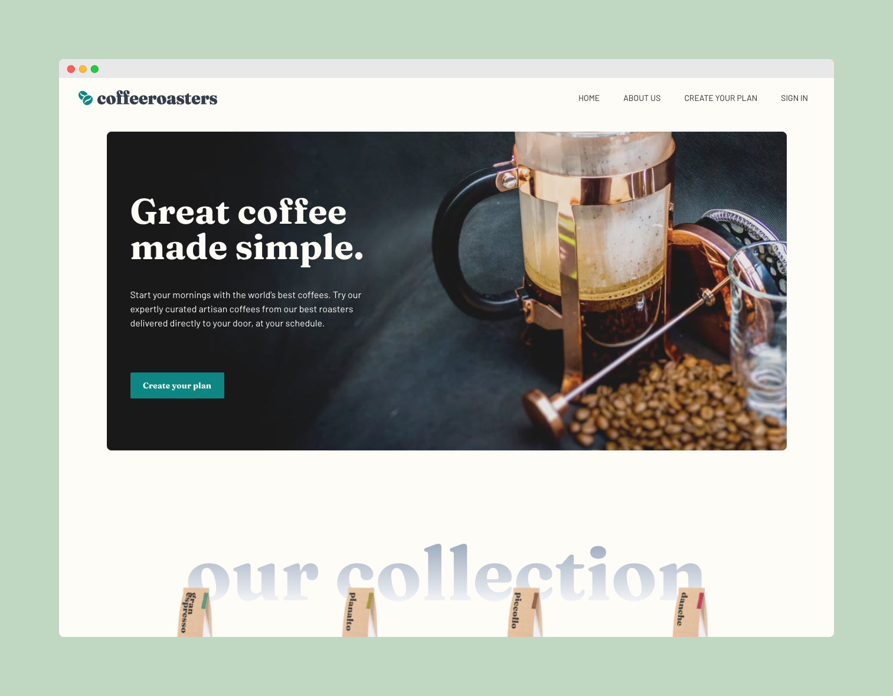

# Frontend Mentor - Coffeeroasters subscription site solution

While this is a solution to the [Coffeeroasters subscription site challenge on Frontend Mentor](https://www.frontendmentor.io/challenges/coffeeroasters-subscription-site-5Fc26HVY6) and Frontend Mentor challenges help you improve your coding skills by building realistic projects, I decided to add extra functionality to create a fully functional SaaS web application.

## Features

- Secure user management and authentication with [Supabase](https://supabase.io/docs/guides/auth)
- Powerful data access & management tooling on top of PostgreSQL with [Supabase](https://supabase.io/docs/guides/database)
- Integration with [Stripe Checkout](https://stripe.com/docs/payments/checkout) and the [Stripe customer portal](https://stripe.com/docs/billing/subscriptions/customer-portal)
- Automatic syncing of pricing plans and subscription statuses via [Stripe webhooks](https://stripe.com/docs/webhooks)

## Table of contents

- [Overview](#overview)
  - [The challenge](#the-challenge)
  - [Screenshot](#screenshot)
  - [Links](#links)
- [My process](#my-process)
  - [Built with](#built-with)
  - [Useful resources](#useful-resources)
- [Author](#author)

## Overview

### The challenge

Users should be able to:

- View the optimal layout for each page depending on their device's screen size
- See hover states for all interactive elements throughout the site
- Make selections to create a coffee subscription and see an order summary modal of their choices

### Screenshot

### Links

- Solution URL: [https://github.com/ericnbello/coffeeroasters-subscription](https://github.com/ericnbello/coffeeroasters-subscription)
- Live Site URL: [https://coffeeroasters-subscription.vercel.app/](https://coffeeroasters-subscription.vercel.app/)

## My process

### Built with

- Semantic HTML5 markup
- CSS custom properties
- Flexbox
- CSS Grid
- Mobile-first workflow
- [Next.js](https://nextjs.org/) - React framework
- [Tailwind](https://tailwindcss.com/) - CSS styling framework
- [Vercel](https://vercel.com) - Deployment platform
- [Supabase](https://supabase.io) - Open-source Firebase alternative
- [Stripe](https://stripe.com) - Subscription payments provider

## Author

- Website - [Eric Bello](https://www.ericnbello.com)
- Frontend Mentor - [@ericnbello](https://www.frontendmentor.io/profile/ericnbello)
- Twitter - [@ericnbello](https://www.twitter.com/ericnbello)