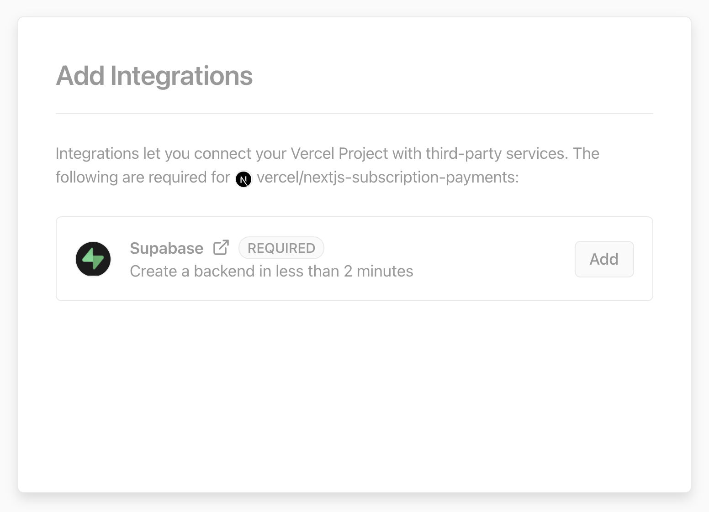

# Frontend Mentor - Coffeeroasters subscription site solution

This is a solution to the [Coffeeroasters subscription site challenge on Frontend Mentor](https://www.frontendmentor.io/challenges/coffeeroasters-subscription-site-5Fc26HVY6). Frontend Mentor challenges help you improve your coding skills by building realistic projects. 

## Table of contents

- [Overview](#overview)
  - [The challenge](#the-challenge)
  - [Screenshot](#screenshot)
  - [Links](#links)
- [My process](#my-process)
  - [Built with](#built-with)
  - [What I learned](#what-i-learned)
  - [Continued development](#continued-development)
  - [Useful resources](#useful-resources)
- [Author](#author)
- [Acknowledgments](#acknowledgments)

## Overview

### The challenge

Users should be able to:

- View the optimal layout for each page depending on their device's screen size
- See hover states for all interactive elements throughout the site
- Make selections to create a coffee subscription and see an order summary modal of their choices

### Screenshot


### Links

- Solution URL: [Add solution URL here](https://your-solution-url.com)
- Live Site URL: [Add live site URL here](https://your-live-site-url.com)

## My process

### Built with

- Semantic HTML5 markup
- CSS custom properties
- Flexbox
- CSS Grid
- Mobile-first workflow
- [Next.js](https://nextjs.org/) - React framework
- [Tailwind](https://tailwindcss.com/) - CSS framework
- [Vercel](https://vercel.com) - Deployment platform

**Note: These are just examples. Delete this note and replace the list above with your own choices**

### What I learned

Use this section to recap over some of your major learnings while working through this project. Writing these out and providing code samples of areas you want to highlight is a great way to reinforce your own knowledge.

To see how you can add code snippets, see below:

```html
<h1>Some HTML code I'm proud of</h1>
```
```css
.proud-of-this-css {
  color: papayawhip;
}
```
```js
const proudOfThisFunc = () => {
  console.log('🎉')
}
```

If you want more help with writing markdown, we'd recommend checking out [The Markdown Guide](https://www.markdownguide.org/) to learn more.


### Continued development

Use this section to outline areas that you want to continue focusing on in future projects. These could be concepts you're still not completely comfortable with or techniques you found useful that you want to refine and perfect.

**Note: Delete this note and the content within this section and replace with your own plans for continued development.**

### Useful resources

- [Example resource 1](https://www.example.com) - This helped me for XYZ reason. I really liked this pattern and will use it going forward.
- [Example resource 2](https://www.example.com) - This is an amazing article which helped me finally understand XYZ. I'd recommend it to anyone still learning this concept.

**Note: Delete this note and replace the list above with resources that helped you during the challenge. These could come in handy for anyone viewing your solution or for yourself when you look back on this project in the future.**

## Author

- Website - [Add your name here](https://www.your-site.com)
- Frontend Mentor - [@yourusername](https://www.frontendmentor.io/profile/yourusername)
- Twitter - [@yourusername](https://www.twitter.com/yourusername)

**Note: Delete this note and add/remove/edit lines above based on what links you'd like to share.**

## Acknowledgments

This is where you can give a hat tip to anyone who helped you out on this project. Perhaps you worked in a team or got some inspiration from someone else's solution. This is the perfect place to give them some credit.

**Note: Delete this note and edit this section's content as necessary. If you completed this challenge by yourself, feel free to delete this section entirely.**


# Next.js Subscription Payments Starter

The all-in-one starter kit for high-performance SaaS applications.

## Features

- Secure user management and authentication with [Supabase](https://supabase.io/docs/guides/auth)
- Powerful data access & management tooling on top of PostgreSQL with [Supabase](https://supabase.io/docs/guides/database)
- Integration with [Stripe Checkout](https://stripe.com/docs/payments/checkout) and the [Stripe customer portal](https://stripe.com/docs/billing/subscriptions/customer-portal)
- Automatic syncing of pricing plans and subscription statuses via [Stripe webhooks](https://stripe.com/docs/webhooks)

## Demo

- https://subscription-payments.vercel.app/

[](https://subscription-payments.vercel.app/)

## Architecture


## Deploy with Vercel

The Vercel deployment will guide you through creating a Supabase account and project. After installing the Supabase integration, you'll need to configure Stripe with a few simple steps.

**Note:** We're working on our Stripe integration. We've documented the required steps below under "Configure Stripe" until the integration is ready.

To get started, click the "Deploy with Vercel" button below.

[](https://vercel.com/new/git/external?repository-url=https%3A%2F%2Fgithub.com%2Fvercel%2Fnextjs-subscription-payments&project-name=nextjs-subscription-payments&repo-name=nextjs-subscription-payments&demo-title=Next.js%20Subscription%20Payments%20Starter&demo-description=Demo%20project%20on%20Vercel&demo-url=https%3A%2F%2Fsubscription-payments.vercel.app&demo-image=https%3A%2F%2Fsubscription-payments.vercel.app%2Fdemo.png&integration-ids=oac_jUduyjQgOyzev1fjrW83NYOv&external-id=nextjs-subscription-payments)

[](https://vercel.com/new/git/external?repository-url=https%3A%2F%2Fgithub.com%2Fvercel%2Fnextjs-subscription-payments&project-name=nextjs-subscription-payments&repo-name=nextjs-subscription-payments&demo-title=Next.js%20Subscription%20Payments%20Starter&demo-description=Demo%20project%20on%20Vercel&demo-url=https%3A%2F%2Fsubscription-payments.vercel.app&demo-image=https%3A%2F%2Fsubscription-payments.vercel.app%2Fdemo.png&integration-ids=oac_jUduyjQgOyzev1fjrW83NYOv&external-id=nextjs-subscription-payments)

Once the project has deployed, continue with the configuration steps below.

The initial build will fail due to missing Stripe environment variables. After configuring Stripe, redeploy the application.

## Configure Supabase Auth

#### [Optional] - Set up OAuth providers

You can use third-party login providers like GitHub or Google. Refer to the [docs](https://supabase.io/docs/guides/auth#third-party-logins) to learn how to configure these.

## Configure Stripe

To start developing your SaaS application, we'll need to configure Stripe to handle test payments. For the following steps, make sure you have the "viewing test data" toggle switched to "on."

### Configure webhook

We need to configure the webhook pictured in the architecture diagram above. This webhook is the piece that connects Stripe to your Vercel serverless functions.

First, click the "Add endpoint" button on the [test Endpoints page](https://dashboard.stripe.com/test/webhooks).

Then, set the endpoint URL to `https://your-deployment-url.vercel.app/api/webhooks`.

Next, click the `receive all events` link in the `Events to send` section.

Finally, copy the `Signing secret` as we'll need that in the next step.

### Set environment variables

To securely interact with Stripe, we need to add a few environment variables in the Vercel dashboard.

- `NEXT_PUBLIC_STRIPE_PUBLISHABLE_KEY`
- `STRIPE_SECRET_KEY`
- `STRIPE_WEBHOOK_SECRET_LIVE`

You can find the first two keys on the [API keys tab](https://dashboard.stripe.com/test/apikeys) in Stripe. The `STRIPE_WEBHOOK_SECRET_LIVE` is the `Signing secret` copied in the previous webhook configuration step.

### Redeploy and Test

We need to redeploy the application so that the latest environment variables are present.

Redeploy your application by going to the deployments tab, finding your deployment, and clicking "redeploy."

Finally, click the `Send test webhook` button and send a `product.created` event. If everything works, you should see a test product in your Supabase database.

After verifying that the configuration is working, delete the test products created via the webhook in Supabase.

### Create product and pricing information

For Stripe to automatically bill your users for recurring payments, you need to create your product and pricing information in the [Stripe Dashboard](https://dashboard.stripe.com/test/products). When you create or update your product and price information, the changes automatically sync with your Supabase database.

Stripe Checkout currently supports pricing that bills a predefined amount at a specific interval. More complex plans (e.g., different pricing tiers or seats) are not yet supported.

For example, you can create business models with different pricing tiers, e.g.:

- Product 1: Hobby
  - Price 1: 10 USD per month
  - Price 2: 100 USD per year
- Product 2: Freelancer
  - Price 1: 20 USD per month
  - Price 2: 200 USD per year

#### Generate test data with the Stripe CLI

The [Stripe CLI](https://stripe.com/docs/stripe-cli#install) `fixtures` command executes a series of API requests defined in a JSON file. To speed up the setup, we have added a [fixtures file](fixtures/stripe-fixtures.json) to bootstrap test product and pricing data in your Stripe account. Simply run `stripe fixtures fixtures/stripe-fixtures.json`.

**Important:** Be sure to start the webhook forwarding (see below) so that the products created by the fixtures command above are imported into your database.

### Configure the Stripe customer portal

1. Set your custom branding in the [settings](https://dashboard.stripe.com/settings/branding)
1. Configure the Customer Portal [settings](https://dashboard.stripe.com/test/settings/billing/portal)
1. Toggle on "Allow customers to update their payment methods"
1. Toggle on "Allow customers to update subscriptions"
1. Toggle on "Allow customers to cancel subscriptions"
1. Add the products and prices that you want
1. Set up the required business information and links

### That's it

That's it. Now you're ready to earn recurring revenue from your customers 🥳

## Going live

### Archive testing products

Archive all test mode Stripe products before going live. Before creating your live mode products, make sure to follow the steps below to set up your live mode env vars and webhooks.

### Configure production environment variables

To run the project in live mode and process payments with Stripe, modify the environment variables from Stripe "test mode" to "production mode." After switching the variables, be sure to redeploy the application.

To verify you are running in production mode, test checking out with the [Stripe test card](https://stripe.com/docs/testing). The test card should not work.

### Redeploy

Afterward, you will need to rebuild your production deployment for the changes to take effect. Within your project Dashboard, navigate to the "Deployments" tab, select the most recent deployment, click the overflow menu button (next to the "Visit" button) and select "Redeploy."

## Develop locally

Deploying with Vercel will create a repository for you, which you can clone to your local machine.

Next, use the [Vercel CLI](https://vercel.com/download) to link your project:

```bash
vercel login
vercel link
```

### Setting up the env vars locally

Use the Vercel CLI to download the development env vars:

```bash
vercel env pull .env.local
```

Running this command will create a new `.env.local` file in your project folder. For security purposes, you will need to set the `SUPABASE_SERVICE_ROLE_KEY` manually from your [Supabase dashboard](https://app.supabase.io/) (Settings > API). Lastly, the webhook secret differs for local testing vs. when deployed to Vercel. Follow the instructions below to get the corresponding webhook secret.

### Use the Stripe CLI to test webhooks

First [install the CLI](https://stripe.com/docs/stripe-cli) and [link your Stripe account](https://stripe.com/docs/stripe-cli#login-account).

Next, start the webhook forwarding:

```bash
stripe listen --forward-to=localhost:3000/api/webhooks
```

Running this Stripe command will print a webhook secret (such as, `whsec_***`) to the console. Set `STRIPE_WEBHOOK_SECRET` to this value in your `.env.local` file.

### Install dependencies and run the Next.js client

```bash
npm install
npm run dev
# or
yarn
yarn dev
```
